# Examples

Every part of the CLI, as a real invocation. Each example runs the built binary in a
bash subshell, captures exactly what it printed, and hands that buffer to
[shellfie](https://github.com/tool3/shellfie), which writes it out as an SVG — so the
pictures below are transcripts, not screenshots or mock-ups.

```bash
npm run examples                  # build, then render all 13
npm run example examples/hex.ts   # or just one
npx tsx examples/hex.ts           # same, if dist is already built
```

Both scripts run `npm run build` first, because every example shells out to `dist/cli.js` —
without a `dist` you get `Cannot find module …/dist/cli.js` in place of every transcript.
`tsx` is a devDependency; plain `node examples/hex.ts` will not work, since these import
`./support` without a file extension.

An example is a list of commands and a little prose:

```ts
import { blank, heading, run, save } from './support'

save('hex', {
  title: '--hex',
  lines: [
    heading('--hex samples the ramp and prints the stops, one per line'),
    blank,
    ...run('grfti sunset --hex -n 5'),
    ...run('for hex in $(grfti aurora --hex -n 6); do grfti "$hex" "  $hex  "; done'),
  ],
})
```

`run` defines `grfti` as a shell function pointing at `dist/cli.js`, so the command in the
script is the command in the picture — pipes, loops, command substitution and all. It runs
with `FORCE_COLOR=3`, because it captures a pipe rather than a tty and the CLI would
otherwise — correctly — drop every escape. `bare` is the same thing without that, which is
how [`depth`](depth.ts) can show what a real pipe does.

## Layout

| Path | Contents |
| ---- | -------- |
| `sources/` | Input files: `banner.txt`, `blocks.txt` (six rows of `█`) and `release.txt` |
| `svgs/` | Output — one `<name>.svg` per example |
| `support.ts` | `run`, `bare` and `save`, so each example stays about the CLI |
| `run-all.ts` | Runs every example in this folder |

## Examples

| Example | What it shows | |
| ------- | ------------- | --- |
| [`paint`](paint.ts) | The basic call: preset, color list, hex pair, full spec | 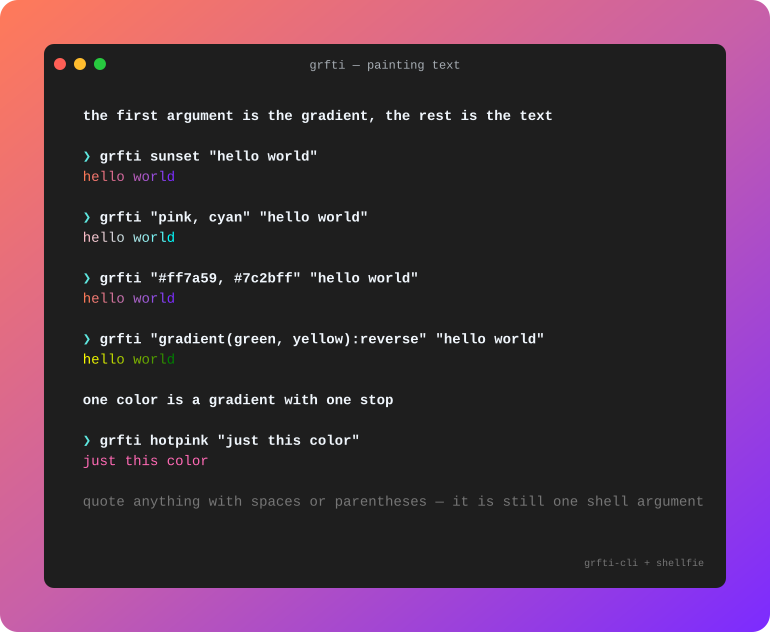 |
| [`swatches`](swatches.ts) | Block files painted in all three directions | 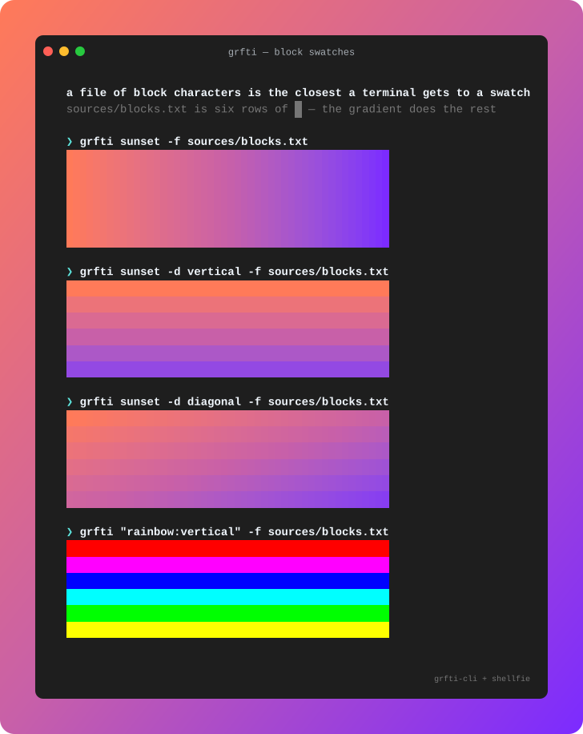 |
| [`presets`](presets.ts) | `--list` | 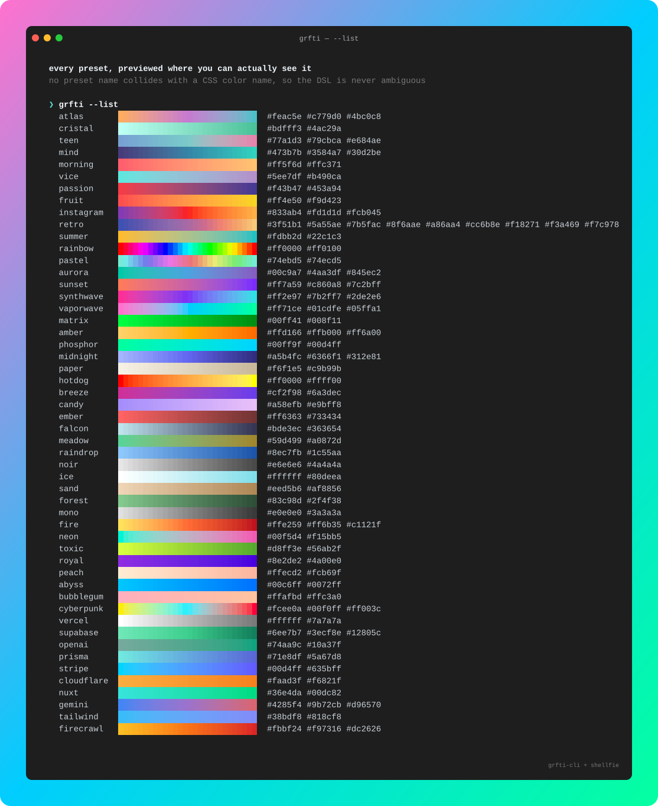 |
| [`colors`](colors.ts) | `--colors` | 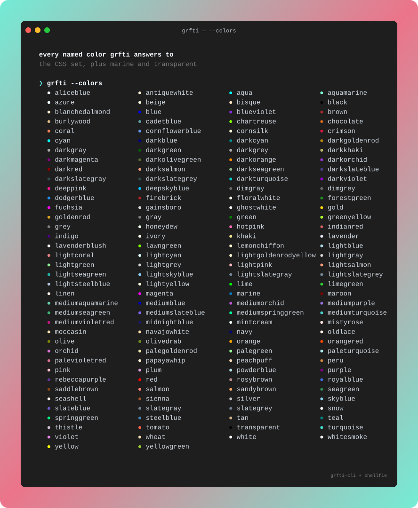 |
| [`flags`](flags.ts) | `-d`, `-r`, `-s`, `-b` — and their DSL equivalents | 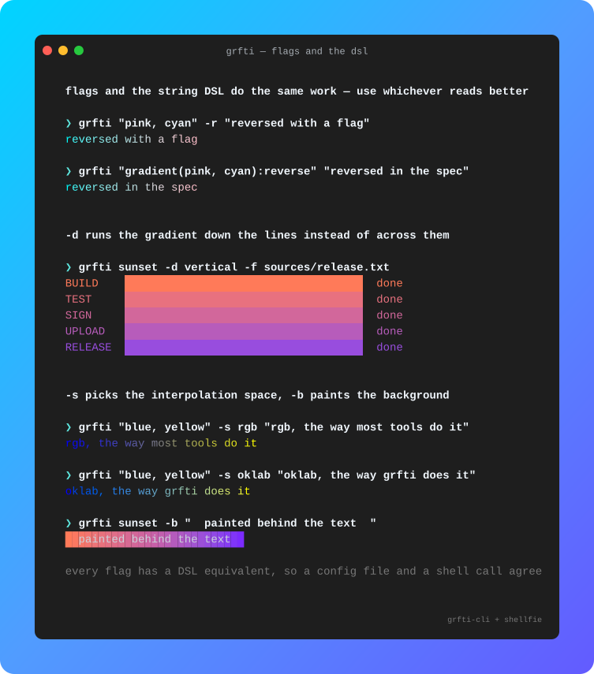 |
| [`banner`](banner.ts) | `-f`, and multi-line input | 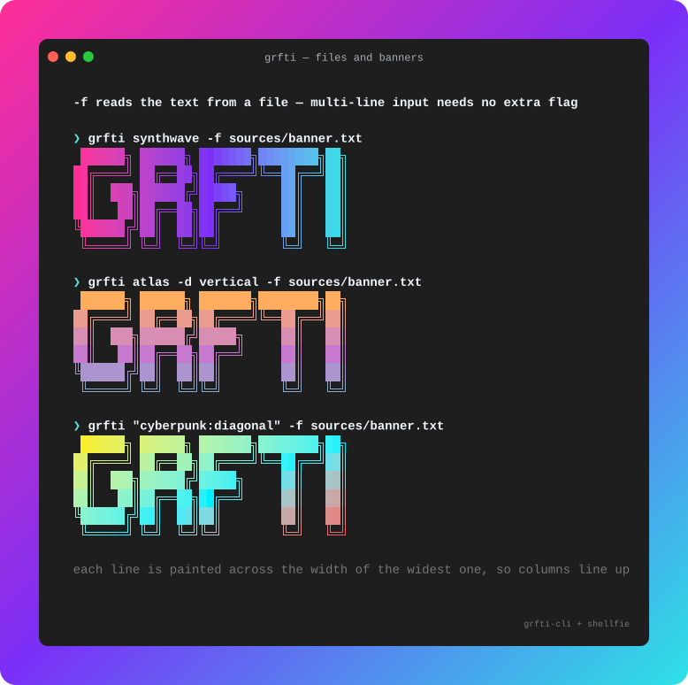 |
| [`stdin`](stdin.ts) | Pipes, as the last stage of anything | 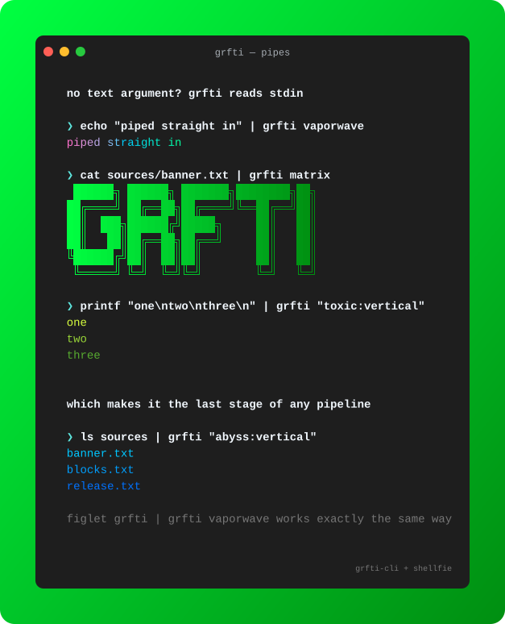 |
| [`info`](info.ts) | `--info` | 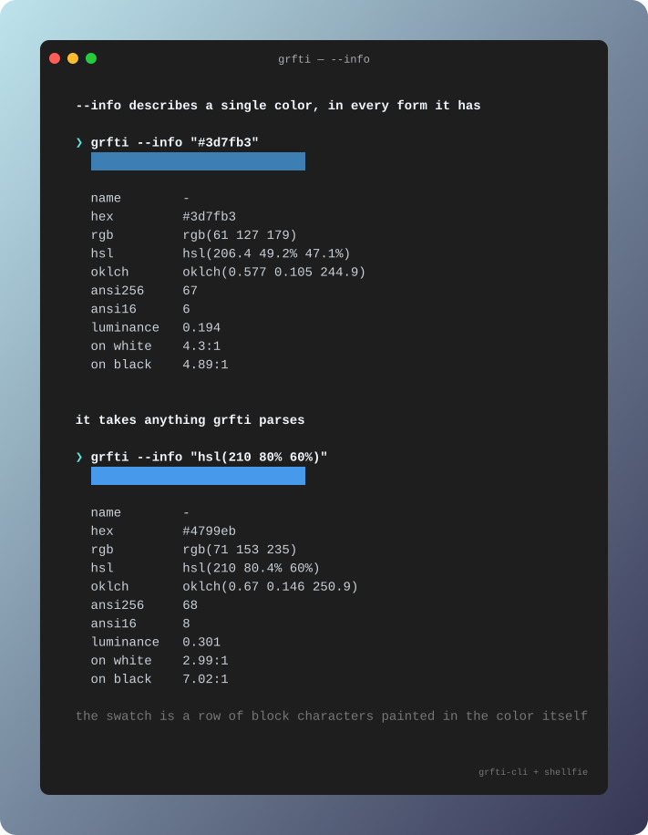 |
| [`hex`](hex.ts) | `--hex -n`, and a shell loop over the result | 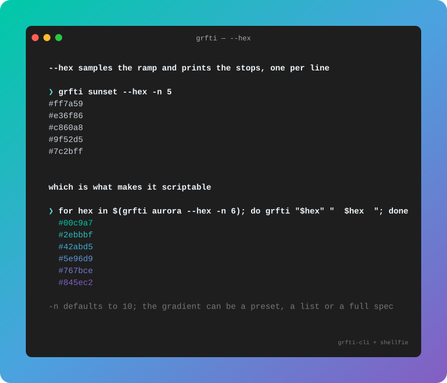 |
| [`css-svg`](css-svg.ts) | `--css`, `--angle`, `--svg --id` | 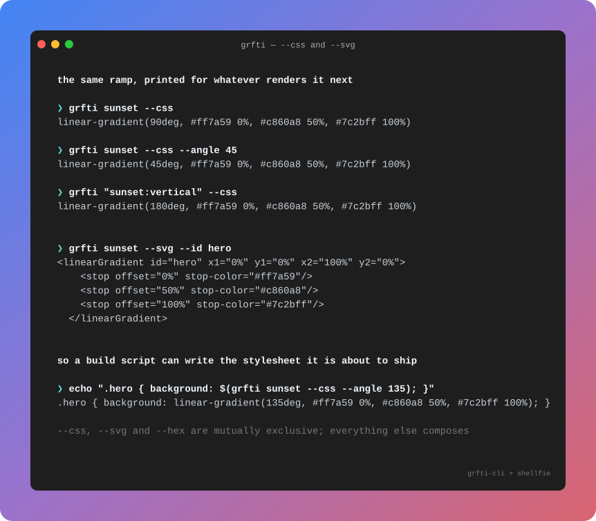 |
| [`depth`](depth.ts) | `-D`, and what happens down a pipe | 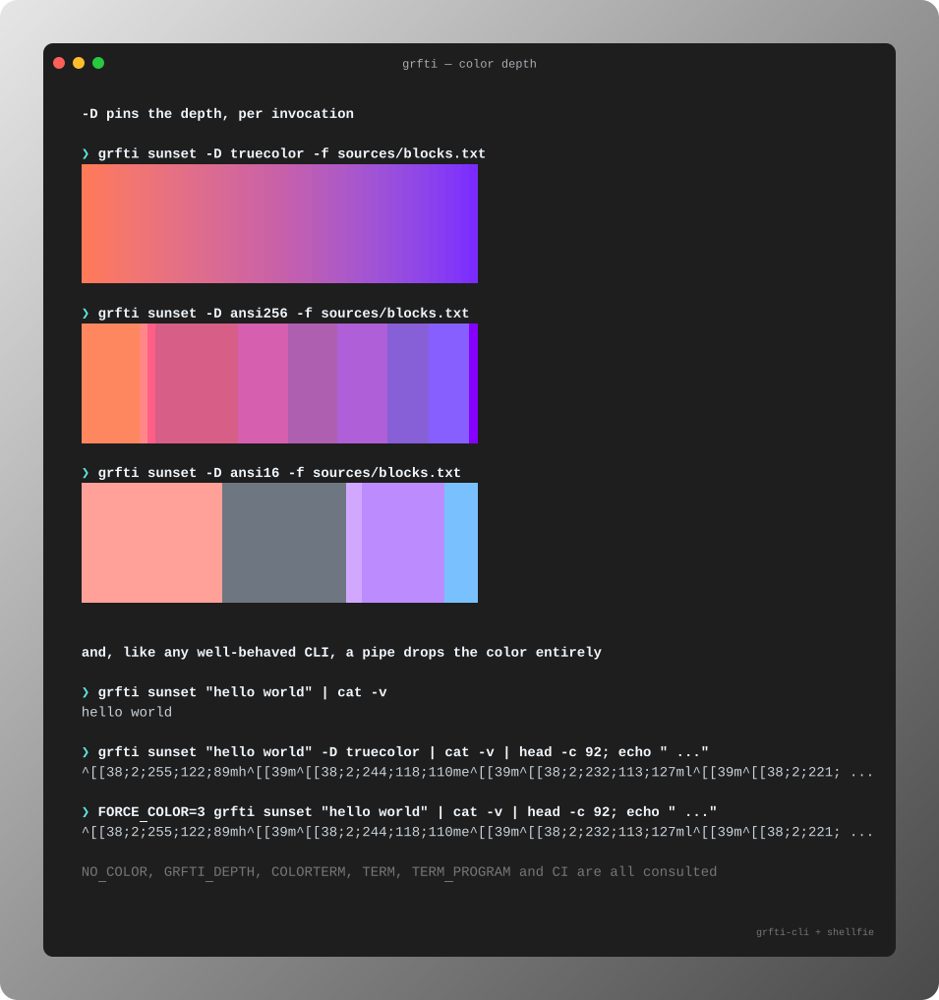 |
| [`errors`](errors.ts) | Typos, suggestions and exit codes | 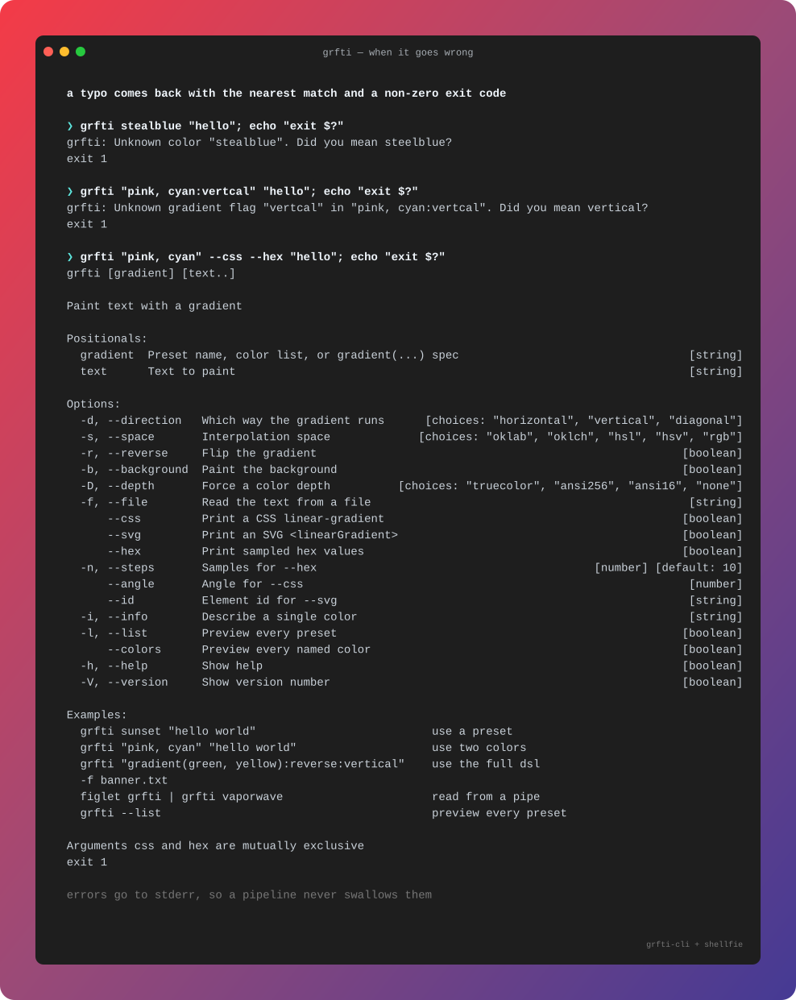 |
| [`help`](help.ts) | `--help` | 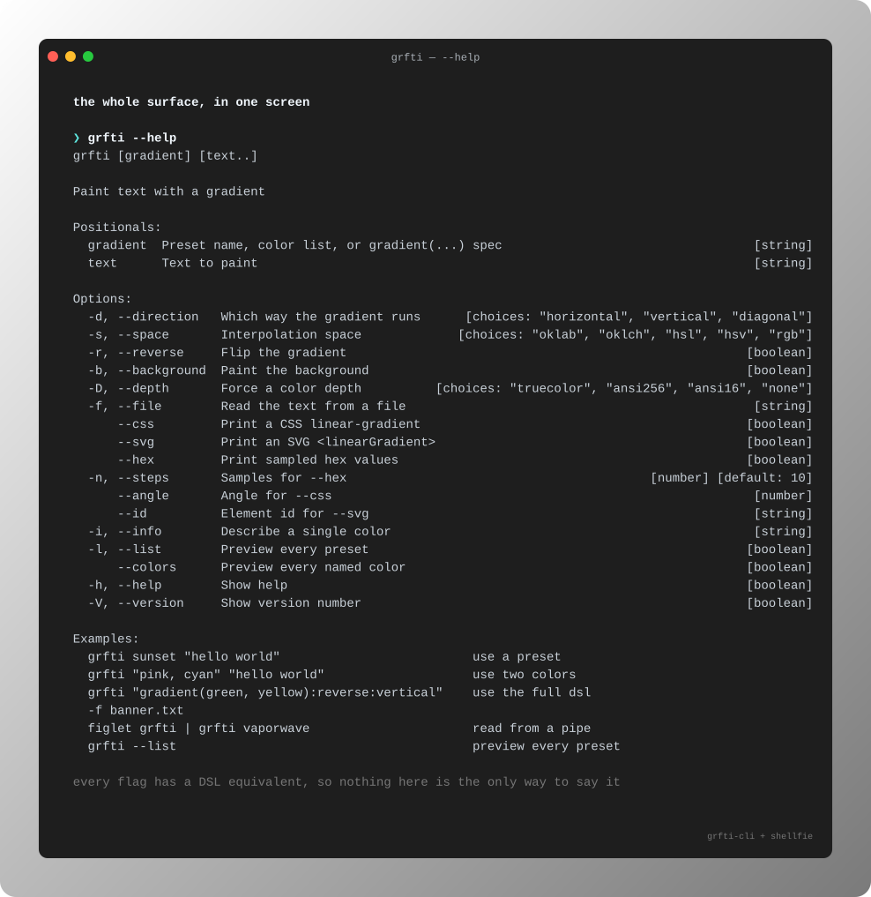 |

## Why blocks

`█` is the widest thing a terminal can paint, so a run of them is the closest a text grid
gets to a swatch. `sources/blocks.txt` is six rows of them and nothing else — point the
CLI at it and the gradient is all you see.

```bash
grfti sunset -f examples/sources/blocks.txt
grfti sunset -d vertical -f examples/sources/blocks.txt
grfti "rainbow:diagonal" -f examples/sources/blocks.txt
```
